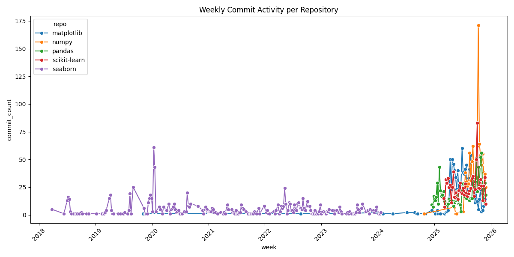

# TEAM NOVA
## Team Members
- Aileen Kent
- Wissal Khlouf
- Ruth Melese

## Overview
This project creates a simple dashboard for development activity across core Python open source libraries, including NumPy, Pandas, Matplotlib, Seaborn, and scikit-learn. We scraped commit history and contributor metadata using the GitHub REST API, sanitized and normalized the results, and imported into a SQLite database for analysis. The results, displayed using pandas and traditional Python visualization libraries, include contributions by week for each library as well as a leaderboard of top contributors per project. The outcome is a quick glance at how some of our core scientific computing libraries have changed over time and how their contributor communities compare in size and engagement.

## Data Source
For this project, we used the GitHub REST API to study the commit history of five major Python libraries, which are pandas, NumPy, scikit-learn, matplotlib, and PyTorch. The API gave us access to detailed commit metadata, including authors, timestamps, messages, and links back to each change. This API allowed us to pull several years of development activity across all five libraries.

## Obstacles and Challenges
There's a limit for authenticated and unauthenticated pulls, so we had to work around that. GitHub returns data in pages of 100 items at a time, so it took a while for the data to loop through page after page to gather everything. To manage this, we built a pipeline that uses batching and a DuckDB database so the data would load cleanly and be analyzed quickly after collection.

## Key Findings
This figure is present in all the five libraries. It appears that the open-source work is not as equally shared as we might think. There are highly active developers in the project, with less active developers at the back end tailing behind. Seaborn is the most extreme example, since the commit history is almost completely in the hands of a single Michael Waskom. Other projects, while more varied in contributor count, have more complex ecosystems, yet can still be seen to have contributors who significantly outweigh others in commit count (for example jorenham, jbockmendel and Loïc Estève). As far as weekly commit activity goes, instead of seeing an even progress, we see more sort of periods of sustained development. Additionally, we see in some repositories (noticeably NumPy) sudden peaks, which may be an artefact of major releases/refactoring/dependency updates.

## Plot Visualization

## GitHub Repo
https://github.com/aileenkent/dp3-github-dashboard

